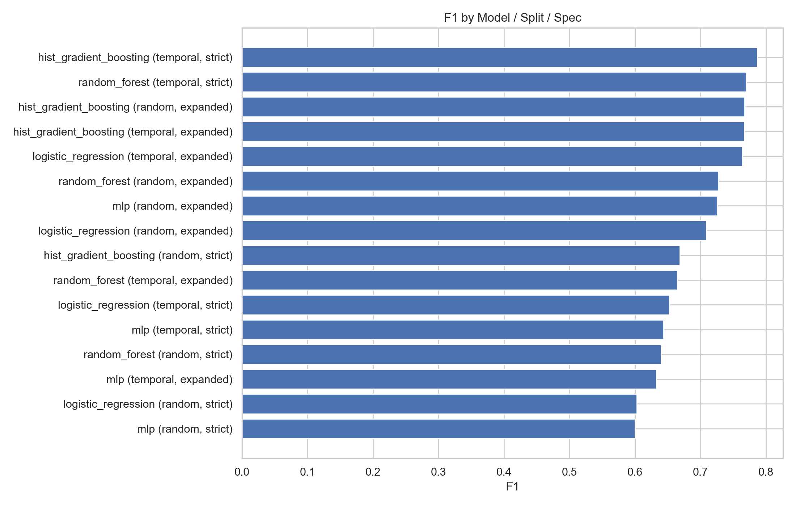
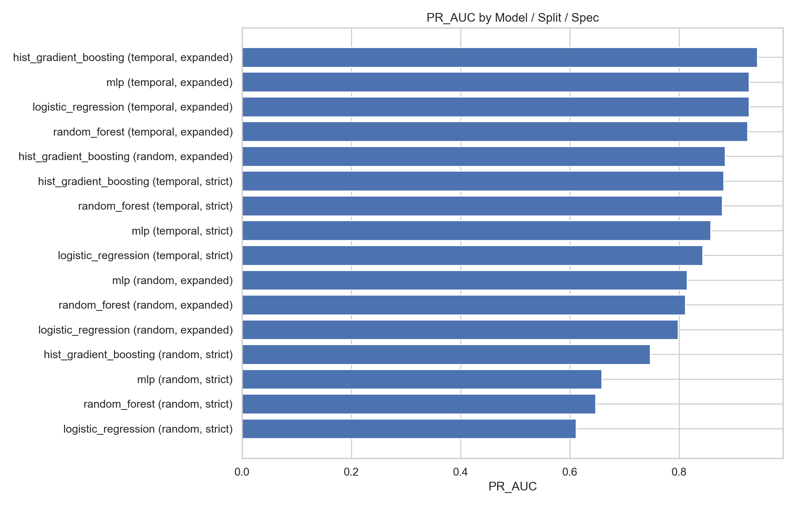
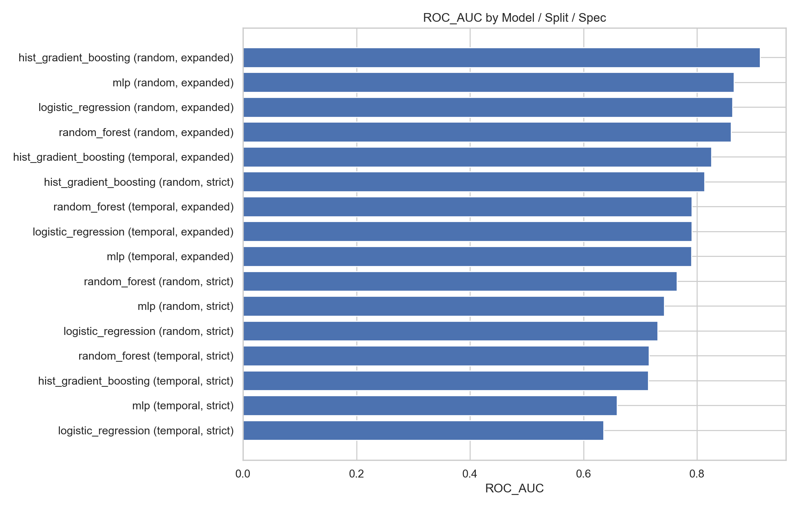
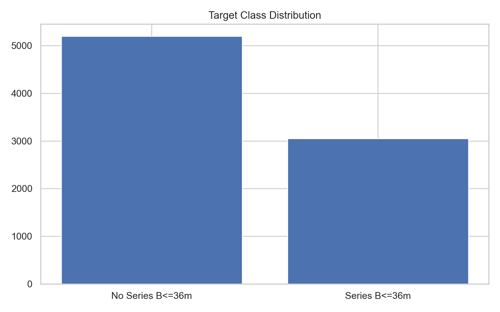
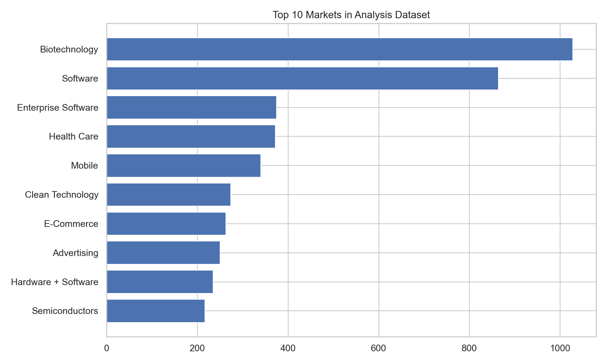
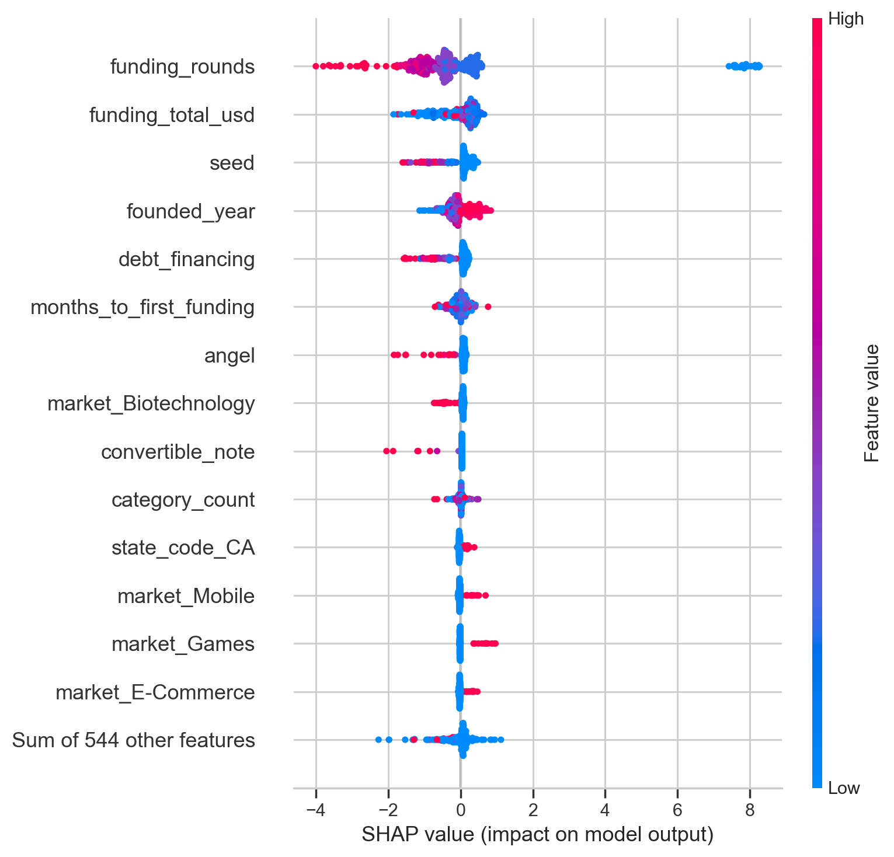

# Forecasting Early-Stage Startup Growth: Series B Prediction


This repository contains my final course project for **Case Studies in Machine Learning** in the **Master of Science in Artificial Intelligence program at The University of Texas at Austin**.

The project studies whether public startup/funding data can be used to predict a practical early-growth milestone: **whether a startup reaches Series B within 36 months of first observed funding**.

Rather than only reporting the best model score, the project compares how results change when the feature boundary and evaluation strategy are made more realistic.

---

## Project summary

**Goal:** predict Series B attainment within 36 months of first funding using a Crunchbase-derived Kaggle dataset.

**Dataset:** public Crunchbase-derived startup investment data from Kaggle. The raw CSV is not included in this repository; see [`data/README.md`](data/README.md).

**Final modeling sample:** 8,245 eligible startups after applying the observation-window and date-quality filters.

**Positive class rate:** 36.98% of eligible startups reached the Series B milestone under the project label definition.

**Target label:** approximate milestone indicator based on `round_B` and the observed first-to-last funding window. The dataset does not provide the exact Series B event date, so the target is treated as a practical proxy rather than a perfect event-history label.

---

## Why this project matters

Startup prediction is a useful but risky machine-learning problem. A model can appear strong if it uses variables that already contain information from the future. To make the evaluation more honest, this project compares:

1. **Strict feature set** — information plausibly available near first funding.
2. **Expanded feature set** — adds broader funding-history variables such as total funding and number of funding rounds.
3. **Random split** — standard shuffled train/test split.
4. **Temporal split** — train on earlier startups and test on later cohorts.

This design makes the project more than an algorithm comparison. It also tests whether the model is doing a realistic forecast or benefiting from easier post-hoc information.

---

## Models evaluated

The pipeline trains four supervised classifiers:

| Model | Purpose |
|---|---|
| Logistic Regression | Interpretable linear baseline |
| Random Forest | Nonlinear tabular baseline with robust performance |
| Histogram Gradient Boosting | Strong tree-based model for structured data |
| MLP Classifier | Shallow neural-network baseline |

Each model is evaluated under both feature specifications and both split strategies. Thresholds are tuned on a validation subset using F1, instead of using the default 0.50 cutoff.

---

## Headline results

Tree-based models were the strongest overall. Histogram-based gradient boosting was the most reliable top performer across the project.

### Best model by F1 in each setting

| Split | Feature spec | Best model | F1 | ROC-AUC | PR-AUC |
|---|---|---:|---:|---:|---:|
| Random | Expanded | HistGradientBoosting | 0.768 | 0.911 | 0.884 |
| Random | Strict | HistGradientBoosting | 0.669 | 0.814 | 0.747 |
| Temporal | Expanded | HistGradientBoosting | 0.767 | 0.825 | 0.943 |
| Temporal | Strict | HistGradientBoosting | 0.787 | 0.714 | 0.882 |

### Main takeaways

- **Histogram Gradient Boosting** was the strongest model family overall.
- **Expanded features improved performance**, but they are less pure as an early-stage forecast because they include more funding-history information.
- **Temporal evaluation did not collapse performance**, suggesting that the signal was not only an artifact of random train/test shuffling.
- **Threshold tuning mattered** because the default 0.50 cutoff was not always appropriate for this imbalanced classification problem.
- **Interpretability showed that funding pace, funding structure, founding year, sector, and geography were important model signals.**

---

## Selected outputs

### Model comparison by F1



### Precision-recall comparison



### ROC-AUC comparison



### Target distribution



### Top startup markets



### SHAP interpretation: temporal expanded gradient boosting model



---

## Repository structure

```text
.
├── artifacts/
│   ├── figures/              # Generated charts and model output plots
│   └── tables/               # Metrics, thresholds, metadata, feature importance
├── data/
│   └── README.md             # Where to place the raw CSV
├── paper/
│   └── Series_B_Prediction_Final_Paper.pdf
├── reports/
│   ├── paper_artifacts/      # Stable snapshot of figures/tables used in the paper
│   └── summary.md            # Short run summary
├── src/
│   ├── data.py               # Data loading, cleaning, target construction
│   ├── modeling.py           # Preprocessing, model training, threshold tuning
│   ├── pipeline.py           # End-to-end orchestration
│   ├── plotting.py           # Figure generation
│   ├── reporting.py          # Metrics and report table exports
│   ├── shap_utils.py         # Optional SHAP interpretation plots
│   └── run_pipeline.py       # Command-line entry point
├── requirements.txt
├── run_end_to_end.sh
└── manifest.json
```

---

## How to run the project

### 1. Clone the repository

```bash
git clone https://github.com/Samanth-ai/series-b-startup-growth-prediction.git
cd series-b-startup-growth-prediction
```

### 2. Create and activate a virtual environment

```bash
python -m venv .venv
source .venv/bin/activate      # macOS/Linux
# .venv\Scripts\activate       # Windows PowerShell
```

### 3. Install dependencies

```bash
pip install -r requirements.txt
```

### 4. Add the raw data

Place the Kaggle Crunchbase CSV in:

```text
data/investments_VC.csv
```

### 5. Run the full pipeline

```bash
bash run_end_to_end.sh
```

Or run it directly:

```bash
python -m src.run_pipeline \
  --input data/investments_VC.csv \
  --output-dir . \
  --clear-outputs
```

To skip SHAP for a faster run:

```bash
python -m src.run_pipeline \
  --input data/investments_VC.csv \
  --output-dir . \
  --clear-outputs \
  --skip-shap
```

---

## Methodology details

### Label construction

A startup is labeled as positive if the data indicate a Series B round and the observed time between first funding and last recorded funding is within 36 months. To avoid labeling startups before enough time has passed, the pipeline keeps firms whose first funding occurred on or before January 1, 2015. Negatives are retained only when at least 36 months of observation are available.

### Feature specifications

**Strict features** include early-stage information such as:

- founding year
- months to first funding
- category breadth
- market, country, and state
- early funding indicators such as seed, angel, grant, convertible note, debt financing, and equity crowdfunding

**Expanded features** add:

- total funding amount
- number of funding rounds

The expanded setup performs better, but the strict setup is closer to a true early-stage prediction task.

### Evaluation

The project reports:

- Accuracy
- Precision
- Recall
- F1
- ROC-AUC
- PR-AUC

F1 is used for validation-based threshold selection because the task is imbalanced and the default threshold is not always the best operational choice.

---

## Important limitations

- The label is approximate because the dataset does not contain the exact Series B date.
- Crunchbase-derived public datasets can have missing values, stale records, and uneven coverage across industries and geographies.
- This is a predictive project, not a causal analysis. Feature importance should not be interpreted as proof that a variable causes Series B success.
- The expanded feature set is more predictive but less clean as an ex ante forecast.

---

## Skills demonstrated

- Applied machine learning for tabular business data
- Feature engineering and leakage-aware feature design
- Time-aware model evaluation
- Imbalanced classification and threshold tuning
- Model comparison across multiple metrics
- SHAP and permutation-based model interpretation
- Reproducible Python project organization
- Portfolio-ready reporting and visualization

---

## Author

**Samanth Hosadurga Chinivar**  
Master of Science in Artificial Intelligence  
The University of Texas at Austin

GitHub: [Samanth-ai](https://github.com/Samanth-ai)
